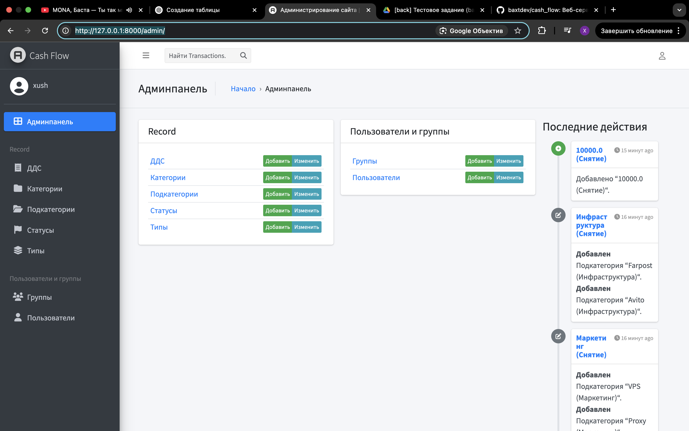
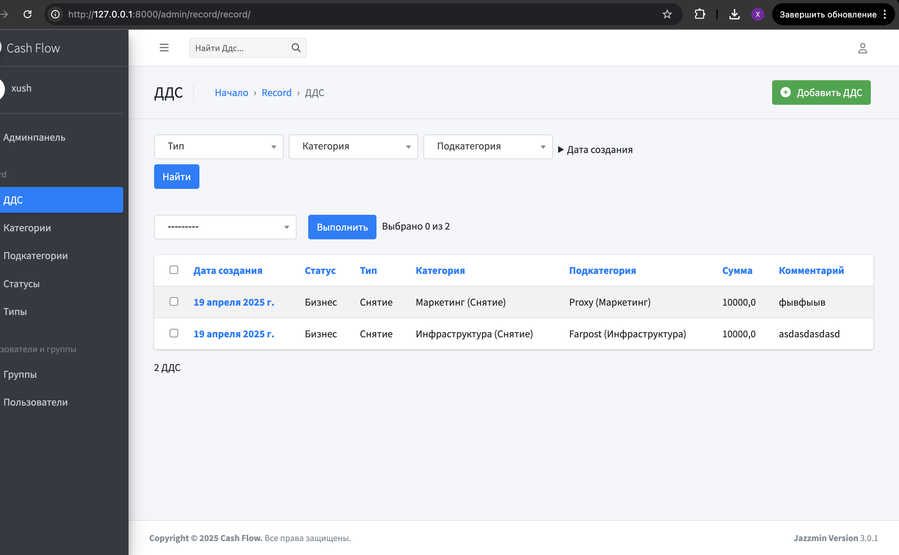
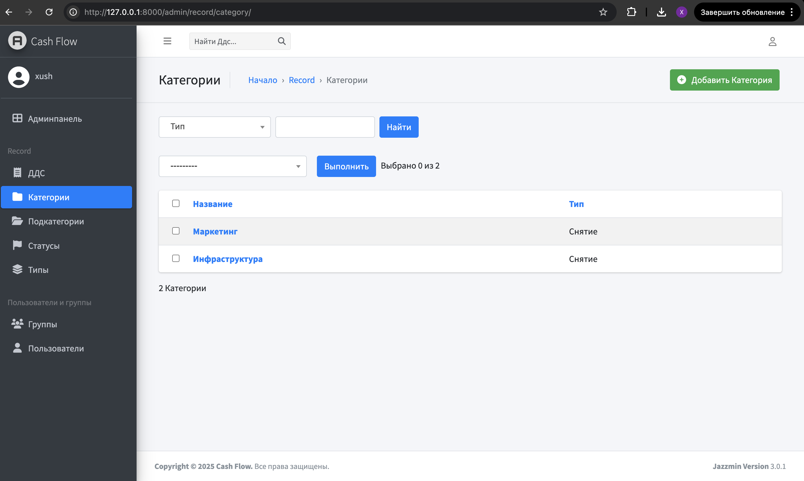
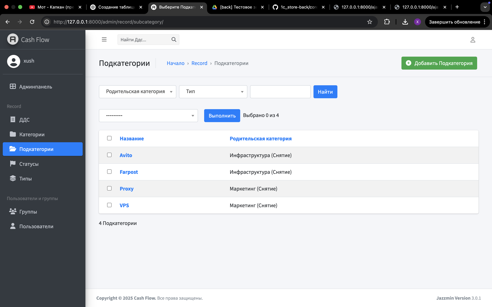
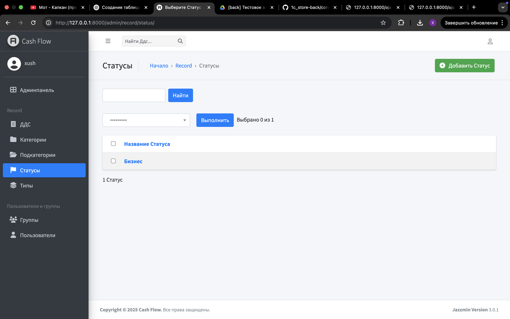
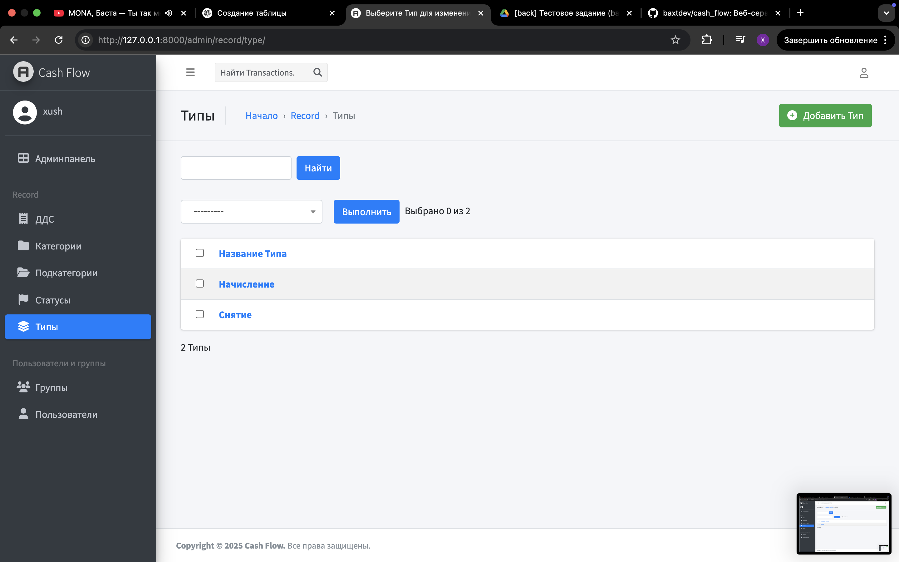
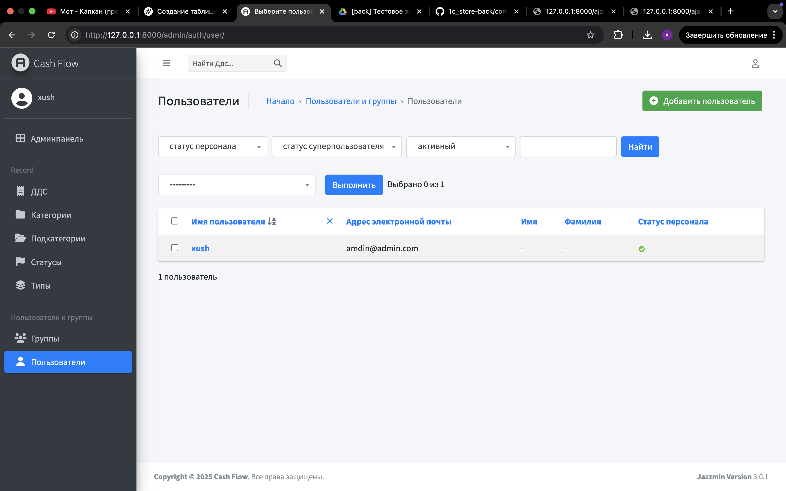

# 💸 Сервис учёта движения денежных средств (ДДС)

**Cash Flow** — это веб-приложение на Django для учёта, анализа и контроля всех денежных операций компании или частного лица. Поддерживает удобную фильтрацию и категоризацию транзакций с возможностью редактирования и администрирования через встроенную панель Django Admin.

---

## 📌 Основные функции

- Учёт всех поступлений и расходов
- Категоризация операций по:
  - Типу (начисление / снятие)
  - Категориям и подкатегориям (например, "Инфраструктура", "Маркетинг")
  - Статусам (например, "Бизнес")
- Добавление комментариев к транзакциям
- Удобная фильтрация по дате, типу, категориям и другим параметрам
- Админка с CRUD-функциями для всех сущностей

---

## 🖼️ Интерфейс

### 📌 Главная панель администратора:


### 📄 Список записей ДДС:


### 🗂 Категории:


### 🗂 Подкатегории:


### 🏷 Статусы:


### 🔄 Типы операций:


### 👥 Пользователи и группы:


---

## ⚙️ Технологии

- Python 3.10+
- Django 4.x
- SQLite (по умолчанию)
- Django Admin(jazzmin)

---

## 🚀 Установка и запуск

1. Клонировать репозиторий:
```bash
git clone https://github.com/baxtdev/cash_flow.git
cd cash_flow/
```
2. Создание виртуального окружения:
```bash
python3 -m venv venv 
source venv/bin/activate
```

3. Установка зависимостей:
```bash
pip install -r requirements.txt
```

4. Запуск сервера:
```bash
python manage.py runserver
```

5. Применение миграций:
```bash
python manage.py migrate
```

6. Создание суперпользователя:
```bash
python manage.py createsuperuser
```
